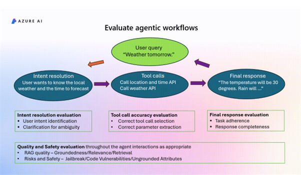

# Agentic-AI-Evaluation
AI agents boost productivity by creating business workflows, but their complex interactions pose observability challenges. This article explains how to run built-in evaluators locally on simple agent data or messages. To develop production-ready agentic applications, developers require tools to evaluate both the final outputs and the quality and efficiency of the workflows. Consider a typical agentic workflow:



A user query like "weather tomorrow" triggers an agentic workflow involving reasoning, tool calling, and retrieval-augmented generation. Evaluating each step and the final response's quality and safety is crucial. The main evaluators for agents are:
-	**Intent resolution**: Determines if the agent correctly identifies the user's intent.
-	**Tool call accuracy**: Assesses if the agent makes correct function tool calls according to the user's request.
-	**Task adherence**: Checks if the final response aligns with assigned tasks per system messages and prior steps.
You can use our built-in evaluators to assess other quality and safety aspects of your workflows. Agents emit messages that need to be transformed into evaluation data for our evaluators. If using Azure AI Agent Service, evaluations are seamless with converter support. For agents built outside Azure AI Agent Service, you can parse agent messages into the required formats to use our evaluators.


Create a virtual Python environment of you choice. 
To create one using conda, run the following command in bash terminal
```
conda create -n agentic_ai_eval
conda activate agentic_ai_eval
```
To create one using python in powershell, run the following command in powershell terminal
```
python -m venv agentic_ai_eval
.\agentic_ai_eval\Scripts\Activate.ps1
```
To create one using python in bash, run the following command in bash terminal
```
python -m venv .agentic_ai_eval
source .agentic_ai_eval/bin/activates
```

### Building and running

Install the required packages by running the following command:
```
pip install -r requirements.txt
```

